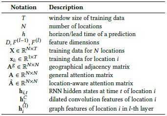

# Cola-GNN

### Paper PDF file

[cola_gnn.pdf](Cola_GNN_review/cola_gnn.pdf)

[cola_gnn_review_김동준.pdf](Cola_GNN_review/cola_gnn_review_%EA%B9%80%EB%8F%99%EC%A4%80.pdf)

### Implement Codes(self try-out)

[GitHub - djkim0516/COLA_GNN: Self try-out to implement COLA_GNN. May contain errors or misunderstandings.](https://github.com/djkim0516/COLA_GNN)

## Abstract

Early prediction of epidemic outbreaks plays a pivotal role in disease intervention & control.

Graph message passing framework 

→ Combining graph structures + Time-series features

Gives interpretable results

## 1. Introduction

Early forecasting of infectious diseases → reduce financial burdens

### **Focusing Problem**

— ****long term ILI forecasting with lead time from 2~15 weeks based on influenza surveillance data collected from multiple locations

→data collection & surveillance lag + accurate statistics delayed by weeks

**makes long-term forecasting imperative**

다수 지역의 환자 수 데이터에 기반한 장기간 감염병 예측 

→ 데이터 수집과 정확한 통계값 추출 어렵기 때문에 예측 반드시 필요

### **Existing works**

**Traditional causal models / Compartmental models / Agent-based models**

→ **Calibrating** the models is challenging due to **high dimensionality** of the parameter space.

인과관계, 구획, 행위자 기반 모델 → 고차원의 변수 조정 어려움

**Statistical models** → not suitable for long term ILI since disease activities, human environments evolve over time. 

통계 모델 → 시간에 따른 감염병 데이터에 부적합

**Deep Learning methods** → ex) RNN : Barely considers cross-spatial effects in long term.

딥러닝 → 장기간의 예측에서 공간에 대한 반영 미미

### Challenges

1. Temporal dependency is hard to capture with short-term input data.
2. The influence of other locations often changes over time.

단기간의 input data로는 시간 의존성을 찾기 어렵다, 지역간의 영향도는 시간에 따라서 변한다.

### Contribution Summary

- Novel graph-based deep learning framework for long-term epidemic prediction form a time-series forecasting perspective.
- Dynamic location-aware attention mechanism to capture spatial correlations.
- Temporal dilated convolution module to automatically extract extract short, long temporal dependencies from time-series data of multiple locations.
- Evaluate the proposed method on three real-world datasets with different long-term prediction settings.

## 2. Related work

### 2.1 Influenza Prediction

Dynamic poisson autoregressive model

Matrix factorization, nearest-neighbor based regression in ensemble methods

Hierarchical Bayesian parametric model

ARGO → data used which is not available nowadays

### 2.2 Long-term Epidemic Prediction

**Two types**

Direct methods - use past values once

Iterative methods - recursively invoke short-term predictors

Sorjamaa - Strategy for selecting input variables by optimizing diff. criteria and using **Least Squares Support Vector Machine(LS-SVM)** for direct multi-step forecasting.

Deep Learning Based Epidimic Forecasting with Synthetic Information(DEFSL)

→ combined DNN with causal models

### 2.3 Spatio-temporal Prediction

societal event forecasting, air quality prediction, traffic forecasting

→text data, climate info

Latitude, longitude, climate information refers to a small area, and the granularity of statistics is lower than that of influenza.

## 3. The Proposed Method

### 3.1 Problem Formulation

1. Location-aware attention  
    - to capture location-wise interaction(edge weights)
2. Dilated Convolution layer 
    - to capture short-term & long-term local temporal dependencies
3. Global graph message passing 
    - to combine the temporal features and the loaction-aware attentions, to learn hidden location embeddings and make predictions

### 3.2 Directed Spatial Influence Learning

Dynamically model the impact of one location on other locations

한 지역에 대한 다른 지역들의 영향 정도를 능동적으로 반영

- geographic distance 지리학적 거리
    - nearby areas - similar topographic, climatic characteristics 유사한 지형학적, 기후적 특징
    - non adjacent areas - population movements, similar geographical features 인구 이동, 유사한 지리학적 특징

### **Location-aware attention mechanism**

- temporal dependencies of locations from historical data
- geographical information

1. **learn hidden states for each location given a time period using RNN etc.**
    
    RNN, GRU, LSTM을 통하여 각 지역에 대한 hidden state 학습
    
    **Data** : multi-location time series data $**X ∈ R^{N*T}**$
    
    $D$ : Dimension of the hidden state
    
    ### ${\displaystyle {\bold h}}_{i,t} = tanh({\displaystyle {\bold w}}x_{i,t} + {\displaystyle {\bold U}{\bold h}}_{i,t-1} + {\displaystyle {\bold b}}) ∈R^D$     (1)
    
    - ${\displaystyle {\bold w},{\bold b}}∈R^D$
    - $U∈R^{D*D}$
    - 모든 지역에 대해서 매시점마다 각각의 hidden state update
    
2. **define a general attention coefficient $a_{i,j}$**
    
    ### $a_{i,j} = {\bold v}^Tg({\bold W}^s{\bold h}_i + {\bold W}^t{\bold h}_j+{\bold b}^s)+b^v$          (2)
    
    - $W^s, W^t∈R^{{d_a}*D}, v∈R^{d_a}, b^s∈R^{d_a}, b^v∈R$
    - $d_a$ : Hyperparameter that controls the dimensions
    - measures the impact of location j on location i
    - RNN으로부터 학습된 각 지역의 hidden state에 대해서 서로에 대한 영향도를 도출
    - i→j 영향과 j→i 영향이 다르다는 가정 : 비대칭(asymmetric) **attention coeff. matrix** ${\bold A}$ 도출
    
    
    
    softmax 대신 행별로 정규화 처리
    
3. **involve the spatial distance btw two locations**
    
    ${\bold A}^g$ : matrix of the connectivity of locations (1 means each are neighbors)
    
    $**{\bold {\hat A}}$ : location-aware attention matrix**
    
    combining ${\bold {\tilde A}}^g$(geographical adjacency matrix_normalized by laplacian?) & ${\bold A}$(attention coeff. matrix)
    

**두 지점간의 영향 계산시, 지형 vs 시간 정보를 비교.**

### 3.3 Multi-Scale Dilated Convolution

감염병 발생은 시간에 따른 특징도 반영이 필요함

ex) US - 주기적으로 12~2월에 계절독감 유행, 5월까지 지속

Convolutional Neural Network(CNN) - successful results in capturing various important local patterns

RNN : 모든 정보를 동일하게 반영

CNN : 중요한 local feature pattern을 잘 반영 → 해당 논문에서 사용

multi-scale dilated conv module - **same filter & stride size**, but **different dilation rate!!!**

각 filter 통과시킨 값을 concatenate → final conv. output

local patterns with short-term & long-term

constrain the data with nonlinear layer to the result

### 3.4 Graph Message Passing - Propagation

Flu propagation model using Graph Neural Networks → message passing

∵Epidemic disease affected by human connectivity & transmission

${\bold W}^{(l-1)}∈{\bold R}^{F^{(l)}*F^{(l-1)}}$  ,  ${\bold b}^{(l-1)}∈{\bold R}^{F^{(l)}}$

### 3.5 Output Layer - Prediction

${\bold h}_{i,T}$와 ${\bold h}^{(l)}_{i}$을 concatenate 후 최종 값 예측

### 3.6 Optimization

compare the prediciton value with ground truth

then optimize a regularized $l_1$-norm

$n_i$ = number of samples in location i obtained by a moving window

$Θ$ = all training parameters

$R(Θ)$ = regualrization term (e.g. $l_2$-norm)

## 4. Experiment Setup

### 4.1 Datasets

- Japan-Prefectures
- US-States
- US-Regions

### 4.2 Evaluation metrics

- Root Mean Squared Error(RMSE)
- Mean Absolute Error(MAE)
- Pearson's Correlation(PCC)

### 4.3 Comparison Methods

AR, GAR, VAR, ARMA, RNN, LSTM, DCRNN, CNNRNN-Res, LSTNet, ST-GCN

**Hyper-parameter Setting & Implementation Details**

ELU for g in eq.2 & eq.9

$d_a$ in location aware attention = $D/2$

## 5. Results

### 5.1 Prediction Performance

- short-term (leadtime =2,3) & long-term(leadtime = 5, 10, 15)
- better than other

### 5.2 Ablation Tests

- w/o temp : remove the dilated temporal conv layer
- w/o loc : remove the location-aware attention module
- w/o geo : remove the geographical adjacent matrix → only the general attention matrix A used
-
